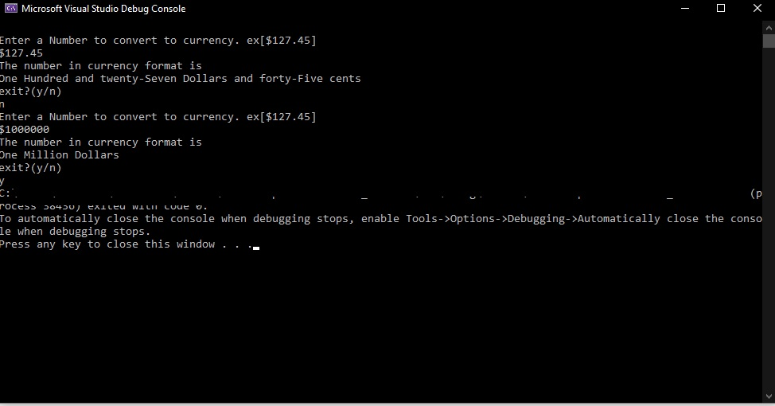

**A code Review**

**Description :** a conversion from number to words in c#

I created this project in order to answer my application test as a .Net programmer,

I created this with Microsoft Visual Studio Community 2022 (64 bit),

and using dot net frame work 6.0, with c# as the main language here.

why? because it is the latest version that I could get, and the community version is free to download

the challenge with this solution is not too compatible with the older version of visual studio

**How to install?**

if you just want to use the program, then find the exe files inside this bin\Debug\net6.0\ folder.

**How to use this project?**

please input you desired number with format:[$][number][.][cents]
and it will tell you in English how you should read them.
there are some restriction like:
1. you cannot put any alphabet character (of course)
2. the length of the string is limited by 15 chars(s)

it should work, otherwise you will need to install .net framework 6.0 in your computer.

look here:

https://dotnet.microsoft.com/en-us/download/dotnet/6.0

you should choose your OS and your type of processor (arm/x64/x86)

**Credits:**

thanks to Luminary : https://www.luminary.com/

I got the code from them, and do some modification to meet my needs.

